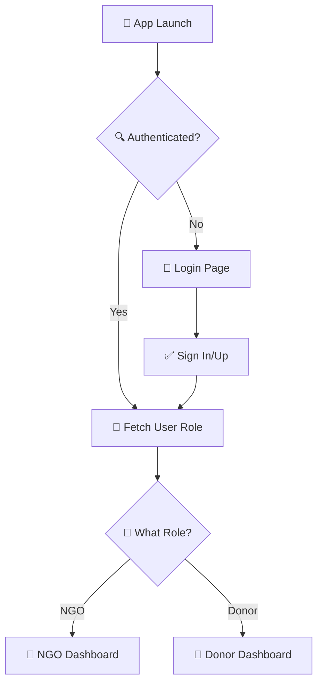

# 🚀 FoodBridge


<div align="center">


**🔥 A blazing-fast Flutter app with Firebase magic ✨**

*Seamless authentication • Role-based routing • Real-time awesomeness*

</div>

---

## 🎯 What's This Beast?

Welcome to the future of Flutter authentication! This isn't just another login app - it's a **smart, role-aware platform** that knows exactly where to send your users. NGOs and donors get their own personalized experiences, all powered by Firebase's real-time superpowers.

## ⚡ Features That'll Blow Your Mind

| Feature | Description | Status |
|---------|-------------|---------|
| 🔐 **Firebase Auth** | Rock-solid authentication | ✅ |
| 🎭 **Smart Routing** | AI-like role detection | ✅ |
| ⚡ **Real-time Magic** | Stream-based everything | ✅ |
| 🌊 **Firestore Power** | Lightning-fast data sync | ✅ |
| 🏗️ **Clean Architecture** | Code that doesn't suck | ✅ |
| 🎨 **Material Design 3** | Gorgeous UI out the box | ✅ |

## 🎪 The Experience



## 🛠️ Tech Stack

<div align="center">

| Frontend | Backend | Database | Auth |
|----------|---------|----------|------|
|  |  |  |  |

</div>

## 🎮 Quick Start Guide

### 🔥 Prerequisites (The Essentials)

- ✅ Flutter SDK (latest and greatest)
- ✅ Firebase project (your digital kingdom)
- ✅ Coffee ☕ (optional but recommended)

### 📦 Dependencies (The Power-Ups)

```yaml
dependencies:
  flutter:
    sdk: flutter
  firebase_core: ^2.24.2    # 🔥 The foundation
  firebase_auth: ^4.15.3    # 🔐 Auth magic
  cloud_firestore: ^4.13.6  # ⚡ Data superpowers
```

### 🚀 Installation (In 3... 2... 1...)

```bash
# 1. Clone this masterpiece
git clone <your-repo-url>
cd <your-project-name>

# 2. Get those dependencies
flutter pub get

# 3. Firebase setup (the secret sauce)
# Follow the Firebase setup below 👇

# 4. Launch! 🚀
flutter run
```

## 🔥 Firebase Setup (The Magic Recipe)

### Step 1: Create Your Firebase Empire
1. Head to [Firebase Console](https://console.firebase.google.com/) 
2. Click "Add project" and give it a cool name
3. Enable Authentication & Firestore (the dream team)

### Step 2: Connect Your App
```bash
# Install the Firebase CLI tools
npm install -g firebase-tools

# Login to Firebase
firebase login

# Configure your project
flutterfire configure
```

### Step 3: Enable the Superpowers
- 🔐 **Authentication**: Email/Password, Google, etc.
- 📊 **Firestore**: NoSQL database magic
- 🔧 **Security Rules**: Lock it down properly

## 📊 Database Schema (The Blueprint)

```javascript
// 🗃️ Firestore Collection: users
{
  "users": {
    "{userId}": {
      "name": "John Doe",           // 👤 Display name
      "email": "john@awesome.com",  // 📧 Email address  
      "role": "donor",              // 🎭 User role (ngo|donor)
      "createdAt": "timestamp",     // ⏰ When they joined
      "isActive": true              // 🟢 Account status
    }
  }
}
```

## 🏗️ Architecture (The Masterplan)

```
🎯 Project Structure
├── 📱 main.dart                 # The launchpad
├── 🔥 firebase_options.dart     # Firebase config
└── 📁 views/
    ├── 🔐 auth/
    │   └── login_page.dart      # Login magic
    ├── 🏢 ngo/
    │   └── ngo_page.dart        # NGO command center
    └── 💝 donor/
        └── donor_page.dart      # Donor paradise
```

## 🎭 User Roles Explained

### 🏢 NGO Users
- **Mission**: Save the world, one donation at a time
- **Dashboard**: Donation tracking, impact metrics, campaigns
- **Superpowers**: Create campaigns, manage donations

### 💝 Donor Users  
- **Mission**: Make a difference with their generosity
- **Dashboard**: Donation history, favorite NGOs, impact tracking
- **Superpowers**: Discover causes, track impact, recurring donations

## 🔧 Customization Options

### 🎨 Theming
```dart
theme: ThemeData(
  colorScheme: ColorScheme.fromSeed(
    seedColor: Colors.deepPurple, // 🎨 Your brand color here!
  ),
  useMaterial3: true, // 🆕 Material You design
),
```

### 🔀 Add New Roles
Want admin users? Super donors? Just extend the role system:

```dart
// In AuthWrapper
if (role == "admin") {
  return AdminPage(name: name); // 👑 Admin dashboard
} else if (role == "super_donor") {
  return SuperDonorPage(name: name); // 💎 VIP experience
}
```

## 🚀 Deployment Ready

### 📱 Android
```bash
flutter build apk --release
# or for app bundle
flutter build appbundle --release
```

### 🍎 iOS
```bash
flutter build ios --release
```

## 🤝 Contributing (Join the Squad!)

We love contributors! Here's how to join the party:

1. 🍴 **Fork** this repo
2. 🌿 **Branch** it (`git checkout -b feature/amazing-feature`)
3. 💻 **Code** your magic
4. ✅ **Test** everything works
5. 📤 **Push** (`git push origin feature/amazing-feature`)
6. 🎉 **PR** and celebrate!

## 📈 Roadmap (What's Coming Next)

- [ ] 🌐 Multi-language support
- [ ] 🔔 Push notifications
- [ ] 📊 Advanced analytics
- [ ] 🎨 Custom themes
- [ ] 🤖 AI-powered matching
- [ ] 📱 Progressive Web App

## 🐛 Issues?

Found a bug? Have an idea? We're all ears!

[](https://github.com/yourusername/yourrepo/issues)

## 📜 License

This project is licensed under the MIT License - see the [LICENSE](LICENSE) file for details.

---

<div align="center">

**Made with ❤️ and lots of ☕**

*If this project helped you, give it a ⭐!*

[](https://github.com/yourusername/yourrepo)

</div>
